# TRON A2A Node.js Demo

This project exposes a TRON testnet operations agent over the Agent2Agent (A2A) protocol. It is a small Node.js/TypeScript demo that shows how another agent or client can discover an Agent Card, send natural-language or structured requests, and receive task status updates plus structured TRON artifacts.

The agent can:

- return wallet or address balances
- prepare an unsigned TRX transfer proposal
- broadcast an explicitly requested TRX transfer
- verify a transaction by hash
- stream task status and structured artifacts

## Architecture

```mermaid
flowchart LR
  user["User or upstream agent"]
  cli["Demo A2A client\nsrc/client.ts"]
  card["Agent Card\n/.well-known/agent-card.json"]
  express["Express server\nsrc/server.ts"]
  sdk["A2A SDK request handler\nDefaultRequestHandler + InMemoryTaskStore"]
  executor["TRON agent executor\nsrc/a2a/tron-agent.ts"]
  parser["Action parser\ntext parts or data parts"]
  wallet["Wallet helpers\nsrc/tron/wallet.ts"]
  tx["Transaction helpers\nsrc/tron/transactions.ts"]
  tronweb["TronWeb client\nsrc/tron/client.ts"]
  network["TRON testnet node\nNile/Shasta via TRON_FULL_HOST"]

  user -->|"npm run client, JSON-RPC, or REST"| cli
  cli -->|"discovers capabilities"| card
  cli -->|"sendMessage or sendMessageStream"| express
  user -->|"direct A2A HTTP client"| express
  express -->|"GET Agent Card"| card
  express -->|"/a2a/jsonrpc or /a2a/rest"| sdk
  sdk -->|"creates task and event bus"| executor
  executor --> parser
  parser -->|"get_tron_balance"| wallet
  parser -->|"prepare, broadcast, verify"| tx
  wallet --> tronweb
  tx --> tronweb
  tronweb -->|"balance, build tx, sign, broadcast, lookup"| network
  executor -->|"status updates + artifact updates"| sdk
  sdk -->|"Task, status-update, artifact-update"| cli
  cli -->|"prints text + JSON artifact data"| user
```



### Flow

1. The client discovers the agent by requesting the Agent Card at `/.well-known/agent-card.json`. The card advertises A2A protocol `0.3.0`, JSON-RPC as the preferred transport, the REST transport, streaming support, and the available TRON skills.
2. The client sends a message to `/a2a/jsonrpc` or `/a2a/rest`. The demo client in `src/client.ts` uses `ClientFactory.createFromUrl()` and sends either a normal `sendMessage()` request or a streaming `sendMessageStream()` request.
3. `src/server.ts` routes the request into the A2A SDK `DefaultRequestHandler`. The handler stores task state in `InMemoryTaskStore` and calls `TronAgentExecutor`.
4. `TronAgentExecutor` publishes a submitted task, moves it to `working`, then parses the incoming message. It accepts plain text commands such as `balance` and `prepare transfer 1 TRX to <address>`, plus structured `data` parts with an `action` field.
5. The parsed action is dispatched to the TRON helper layer:
   - `get_tron_balance` calls `getBalance()` in `src/tron/wallet.ts`.
   - `prepare_trx_transfer` builds an unsigned TRX transfer in `src/tron/transactions.ts`.
   - `broadcast_trx_transfer` signs and broadcasts the transfer. This requires `TRON_PRIVATE_KEY`.
   - `verify_transaction` looks up the transaction and receipt by transaction id.
6. The helper layer creates a TronWeb instance from `src/tron/client.ts`, using `TRON_FULL_HOST`, optional `TRON_PRO_API_KEY`, and optional `TRON_PRIVATE_KEY`.
7. The executor returns the result as an A2A artifact with both text and JSON data, then publishes a final `completed` status. If an error occurs, it publishes a final `failed` status with the error message.

## Project Layout

```text
src/
  server.ts              Express server and A2A transport wiring
  client.ts              Demo A2A client for normal and streaming requests
  probe.ts               Agent Card probe helper
  config.ts              Environment variable loading and defaults
  a2a/
    agent-card.ts        Agent Card metadata and advertised skills
    tron-agent.ts        A2A executor, parser, task status, and artifacts
  tron/
    amount.ts            TRX/SUN parsing and formatting helpers
    client.ts            TronWeb construction
    transactions.ts      Prepare, broadcast, and verify transaction logic
    wallet.ts            Balance lookup logic
```

## Protocol Note

The A2A docs at `https://a2a-protocol.org/latest/` describe the latest protocol line. The stable JavaScript SDK currently published as `@a2a-js/sdk@0.3.13` implements A2A `v0.3.0`; this demo uses that stable package for a working Node.js implementation. The package also publishes a `next` alpha for the newer line.

## Requirements

- Node.js `22` or newer
- npm
- TRON testnet access through `TRON_FULL_HOST`
- A funded TRON testnet private key only when broadcasting transactions

## Setup

```bash
npm install
cp .env.example .env
```

The default `.env.example` points at Nile:

```env
PORT=4000
AGENT_BASE_URL=http://localhost:4000
TRON_NETWORK=nile
TRON_FULL_HOST=https://nile.trongrid.io
TRON_PRO_API_KEY=
TRON_PRIVATE_KEY=
```

`TRON_PRIVATE_KEY` is required for transfer proposals that use the configured demo wallet and for broadcasts. Balance checks for an explicit address and transaction verification can run without a private key.

## Run

Start the A2A agent:

```bash
npm run server
```

Inspect the Agent Card:

```bash
curl http://localhost:4000/.well-known/agent-card.json
```

You can also use the built-in probe:

```bash
npm run probe
```

Send messages through the demo A2A client:

```bash
npm run client -- "balance"
npm run client -- "balance TXXXXXXXXXXXXXXXXXXXXXXXXXXXXXXX"
npm run client -- "prepare transfer 1 TRX to TXXXXXXXXXXXXXXXXXXXXXXXXXXXXXXX"
npm run client -- "verify <transaction_id>"
```

Broadcasting requires `TRON_PRIVATE_KEY` and an explicit broadcast request:

```bash
npm run client -- "broadcast 1 TRX to TXXXXXXXXXXXXXXXXXXXXXXXXXXXXXXX"
```

Streaming example:

```bash
npm run client:stream -- "prepare transfer 1 TRX to TXXXXXXXXXXXXXXXXXXXXXXXXXXXXXXX"
```

## A2A Endpoints

- Agent Card: `GET /.well-known/agent-card.json`
- JSON-RPC: `/a2a/jsonrpc`
- HTTP+JSON REST: `/a2a/rest`

## Message Formats

### Natural Language

The executor parses these natural-language patterns:

```text
balance
balance TXXXXXXXXXXXXXXXXXXXXXXXXXXXXXXX
prepare transfer 1 TRX to TXXXXXXXXXXXXXXXXXXXXXXXXXXXXXXX
broadcast 1 TRX to TXXXXXXXXXXXXXXXXXXXXXXXXXXXXXXX
verify 0123456789abcdef0123456789abcdef0123456789abcdef0123456789abcdef
```

### Structured Data Parts

Other agents can send `data` parts instead of relying on text parsing:

```json
{
  "action": "prepare_trx_transfer",
  "to": "TXXXXXXXXXXXXXXXXXXXXXXXXXXXXXXX",
  "amountTrx": "1"
}
```

Supported actions:

- `get_tron_balance`
- `prepare_trx_transfer`
- `broadcast_trx_transfer`
- `verify_transaction`

Example structured requests:

```json
{
  "action": "get_tron_balance",
  "address": "TXXXXXXXXXXXXXXXXXXXXXXXXXXXXXXX"
}
```

```json
{
  "action": "verify_transaction",
  "txId": "0123456789abcdef0123456789abcdef0123456789abcdef0123456789abcdef"
}
```

## Response Shape

The agent returns A2A task events. Successful requests include:

- a text summary, such as `Prepared 1 TRX transfer from ...`
- an artifact name, such as `TRX transfer proposal`
- a JSON `data` part containing the balance, transfer proposal, broadcast result, or verification result

Streaming clients receive the same information incrementally as task status and artifact update events.

## Build

Run the TypeScript compiler without emitting files:

```bash
npm run build
```

## Safety

Use testnet only. Keep `TRON_PRIVATE_KEY` server-side and out of logs, commits, browser clients, and upstream agent messages. The demo never broadcasts unless the incoming request asks for `broadcast_trx_transfer` or the natural-language prompt starts with `broadcast`.
